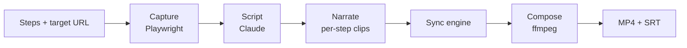

# DemoFoundry

Turn a click-flow through your web app into a **narrated, subtitled demo video — automatically.**
Building demos by hand is as slow as building the app; DemoFoundry generates them, so a release is a
command, not a week of screen-recording.

> **Status:** MVP, local-first. Targets your own React/web apps on `localhost`. Native-desktop and
> SaaS are documented future tracks.

## How it works



DemoFoundry drives your app once with Playwright (recording video + timestamped actions), has Claude
write the narration, renders per-step voice clips, and then the **sync engine** — the core
differentiator — automatically aligns audio and video: it pauses the video when the narration runs
long and fast-forwards it when the action runs long. Because the tool owns *both* timelines, that
alignment is computed, not hand-edited.

## Install

```bash
git clone git@github.com:xolvco/demofoundry-lib.git
cd demofoundry-lib/backend
python -m venv .venv && . .venv/Scripts/activate     # macOS/Linux: .venv/bin/activate
pip install -e ".[all]"
playwright install chromium                           # for capture
# ffmpeg must be on PATH (https://ffmpeg.org) for compose
```

Keys are optional — without them the pipeline still produces a synced video (silent narration, no
Claude scripting). Copy `.env.example` to `.env` to enable `ANTHROPIC_API_KEY` (scripting) and
`ELEVENLABS_API_KEY` (voice).

## Use

```bash
# whole pipeline against your app
demofoundry render --url http://localhost:3000 --steps steps.json --out-dir work
#   -> work/render/demo.mp4 + demo.srt

# or the local web UI
demofoundry serve --port 8000          # http://localhost:8000
```

Each pipeline stage is also its own subcommand (`capture`, `script`, `tts`, `sync`, `compose`) that
chains on JSON artifacts — see the [CLI guide](docs/guide/cli.md).

## Library

It's a reusable library with a CLI and web app as thin frontends; the core
(`models`/`sync`/`serde`/`compose`) is pure stdlib. See the [library guide](docs/guide/library.md).

```python
from demofoundry.pipeline import sync   # the sync engine, dependency-free
```

## Docs

Built with MkDocs Material (`pip install -r requirements-docs.txt && mkdocs serve`):

- [Architecture overview](docs/architecture/index.md) · [MVP](docs/architecture/mvp.md) ·
  [Sync engine](docs/architecture/sync-engine.md)
- [Feature list](docs/features.md) · [CLI](docs/guide/cli.md) · [Library](docs/guide/library.md)

## Tests

Per-stage; the core runs with no binaries or keys:

```bash
cd backend
for t in sync serde tts cli compose capture; do python tests/test_$t.py; done
```

`test_capture` (Playwright) and `test_compose`'s render (ffmpeg) skip when their binary is absent.

## License

[MIT](LICENSE) © 2026 Xolvco
