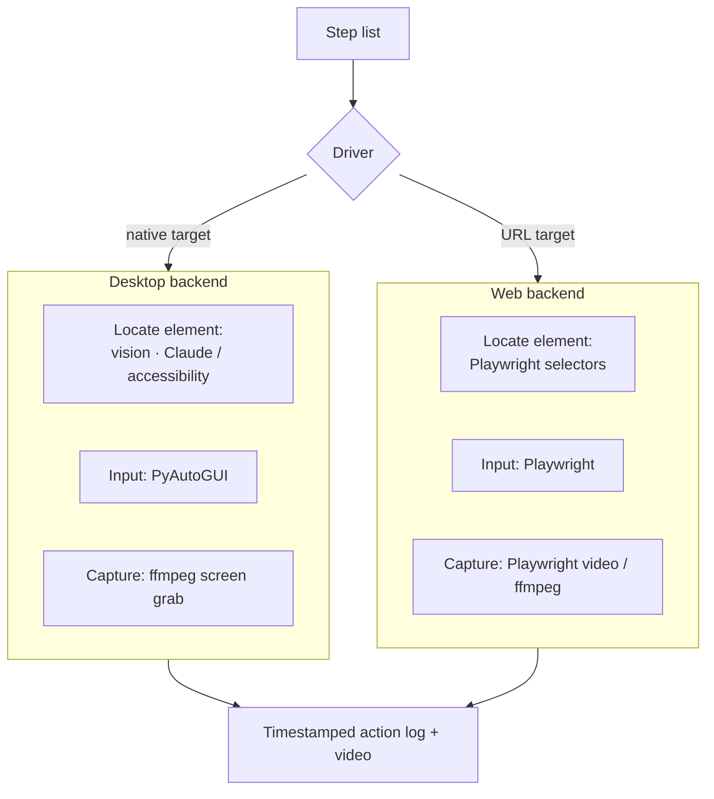

# Automation & Capture

DemoFoundry drives the target application, performs the clicks and keystrokes for each
[step](index.md#core-data-model-the-step-list), and records the screen — logging the exact
timestamp of every action so the [sync engine](sync-engine.md) can align the video to the
narration.

Because the primary targets are **native desktop apps** (and arbitrary third-party apps for
tutorials), automation cannot rely on a DOM or a cooperative accessibility tree. The design is a
**driver abstraction** with two backends behind one interface.

## Desktop backend (primary)

For native apps the robust, general approach is **screen-record + vision-driven input**:

| Concern | Approach |
|---|---|
| **Where to click** | Send a screenshot to **Claude vision / computer-use**; it returns the target element's coordinates. This works on any app, including ones DemoFoundry has never seen. |
| **Fast path** | Where the app exposes an accessibility tree (**UIAutomation** on Windows, **AX** on macOS, **AT-SPI** on Linux), query it directly for stable, cheap element lookup before falling back to vision. |
| **Input** | **PyAutoGUI** for cross-platform mouse moves, clicks, and keystrokes. |
| **Capture** | **ffmpeg** with the platform screen input: `gdigrab` (Windows), `avfoundation` (macOS), `x11grab` / PipeWire (Linux). Region/window capture where supported. |

Each executed step writes an entry to the **action log** — `{ step_id, action, started_at, ended_at,
click_xy }` — timestamped against the same clock as the recording. That log is what makes automatic
sync possible.

!!! note "Why vision, not just accessibility"
    Accessibility trees are faster and more precise, but third-party apps expose them
    inconsistently (custom-drawn UIs, games, Electron apps with poor a11y). Vision-based location
    via Claude is the universal fallback so a tutorial can target *any* app; the accessibility path
    is an optimization layered on top.

!!! note "Status: vision-driven auto-input is aspirational"
    The vision/PyAutoGUI *auto-driver* above is the long-term design. What ships today for desktop
    is the simpler, fully reliable **manual screen-capture** backend below — it produces the same
    output contract, so the auto-driver can slot in later without touching the rest of the pipeline.

## Manual screen-capture backend (shipped)

Driving arbitrary desktop apps from the outside is fragile, so the shipped desktop path inverts it:
**you** drive the app, and DemoFoundry just records and times it (`pipeline/screencap.py`).

| Concern | Approach |
|---|---|
| **Capture** | **ffmpeg `gdigrab`** records a chosen window (matched by title) or the primary monitor. |
| **Where to click** | A **pynput** global mouse hook logs every real click — position + time — for highlight/zoom in post. No app cooperation needed. |
| **Scene timing** | A **pynput** keyboard hook logs **F9** marks (and Esc to stop). Marks are the boundaries between scenes; the first scene starts at the top of the recording. |

`screencap.to_records()` converts those marks/clicks into the same `ActionRecord` list the browser
backend emits — `{ step_id, started_at, ended_at, click_xy, … }` — so `narrate → sync → compose`
(via the shared `render._narrate_sync_compose`) runs unchanged. See the
[Screen capture guide](../guide/screen-capture.md) for usage.

## Web backend

When the target is a URL, **Playwright (Python)** is the specialized backend: stable selectors,
reliable waits, and **native video recording**. It produces the same timestamped action log as the
desktop backend, so everything downstream is identical.

## Output contract

Both backends produce exactly two things for the rest of the pipeline:

1. a **screen recording** of the walkthrough, and
2. a **timestamped action log** aligned to that recording.

The [sync engine](sync-engine.md) consumes both, plus the narration timings from TTS, to build the
final time-aligned video.
