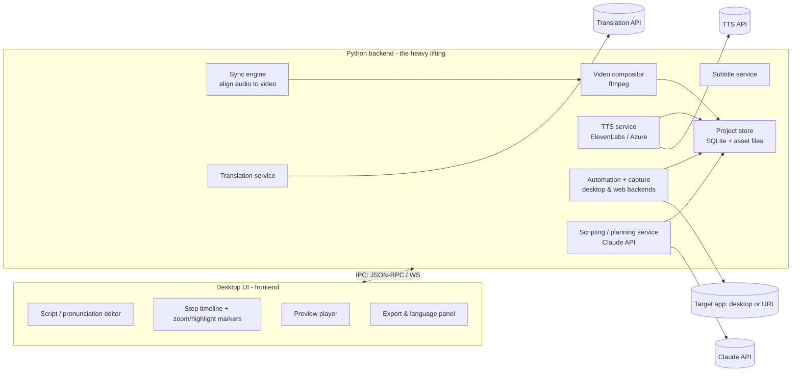

# Architecture Overview

DemoFoundry is a cross-platform desktop app (Windows, macOS, Linux) that turns a narration
script into a finished, localized demo video. It primarily demos **native desktop applications**,
and can also drive **web apps** at a URL. The heavy lifting — automation, text-to-speech, video
composition, subtitling, translation, and the AI that writes the script — lives in a **Python
backend**, with a desktop UI on top.

## The core thesis

DemoFoundry generates **both sides** of the demo:

- it renders the **narration**, so it knows each segment's exact audio duration, and
- it drives the **app**, so it logs the exact timestamp of every action.

Because it owns both timelines, it can **automatically synchronize** narration and video — pausing
the video when narration runs long, fast-forwarding the video when the action runs long — with no
manual timeline editing. A tool that only records the screen has just one side of the timeline and
must make you place every pause by hand. This auto-sync is DemoFoundry's reason to exist; see the
[Sync engine](sync-engine.md).

## Core data model: the step list

Everything ties together through one abstraction: a demo is a **list of steps (scenes)**. Each step
bundles narration, an action, and presentation notes:

```text
{ narration_text, pronunciation_override, action (click/type/navigate/keypress),
  target (vision hint or selector), zoom_target, highlight_target }
```

[Claude writes both the narration and this step list](scripting.md). The narration audio length
drives each step's on-screen timing; the action and zoom/highlight are synced to it. The editor,
the automation engine, and the compositor all speak this same model.

## Components



## Technology choices

Most of the pipeline (desktop/web automation, ffmpeg, Whisper, TTS, the Claude API) is best served
by the **Python** ecosystem, so Python owns the backend. The remaining decision is which **desktop
shell** hosts the UI:

| Option | Stack | Best when | Cost |
|---|---|---|---|
| **Electron + Python sidecar** | TS/React + Python | Polished editor-style UI; richest ecosystem; `<video>` preview is trivial | Heavier runtime; 2 languages |
| **Tauri + Python sidecar** | Rust + TS + Python | Bundle size / security matter and Rust is acceptable | 3 toolchains; Python negates the size win |
| **PySide6 (Qt)** | Pure Python | One language, native widgets, strong media/timeline support | Less "modern web" feel; editor UI is more custom work |

A web frontend + Python sidecar fits the timeline/video-editor experience well; Electron is the
lower-risk default, PySide6 the strong single-language alternative. With Tauri or Electron, the
sidecar is packaged with PyInstaller and the UI talks to it over a local **WebSocket / JSON-RPC**
bridge so long jobs (record, render, translate) can stream progress.

## Subsystem deep-dives

- [MVP — local web app](mvp.md) — the **first build**: a local-first FastAPI + React app driving
  your own React apps via Playwright. Start here; the sections below describe the fuller system the
  MVP grows into.
- [Automation & capture](automation.md) — driving native desktop apps and web apps, and recording
  the screen with timestamped actions.
- [Sync engine](sync-engine.md) — the automatic narration ↔ video alignment that is the product's
  core differentiator.
- [Scripting with Claude](scripting.md) — how Claude authors the narration and the step list.

## Libraries

| Concern | Library | Role |
|---|---|---|
| Scripting & step planning | **Claude API** (`claude-opus-4-8`) | Writes narration + the step list; can drive the app agentically via computer-use |
| Desktop automation | **PyAutoGUI** + vision (Claude) / **UIAutomation·AX·AT-SPI** | Mouse/keyboard input; locate UI elements by vision, or by accessibility tree where available |
| Web automation | **Playwright (Python)** | Drives URL targets with stable selectors and native video recording |
| Screen capture | **ffmpeg** (`gdigrab` / `avfoundation` / `x11grab`) | Records the desktop/window with per-action timestamps |
| TTS | **ElevenLabs / Azure Speech SDK** | Voice selection + audio; both return **word-level timings** |
| Subtitle timing | **faster-whisper** (fallback) | Forced alignment only when the TTS timings are unavailable |
| Video composition | **ffmpeg** (`ffmpeg-python`) | Time-remap per step (speed/freeze/trim), zoom, highlight overlays, mux audio, final MP4 |
| Translation | **DeepL / an LLM** | Translate the *original* script → re-run TTS + regenerate SRT per language |
| Project persistence | **SQLite** + asset folder | Step list / metadata in SQLite; audio/video/renders on disk |
| UI ↔ Python bridge | **WebSocket / JSON-RPC** | Streams long-job progress back to the UI |
| Packaging Python | **PyInstaller** | Bundles the sidecar so users don't install Python |

## Data flow

The UI (or Claude) builds the **step list**, then the Python backend runs the pipeline:

1. **Scripting service** (Claude) authors the narration and step list.
2. **TTS service** renders narration audio and captures word-level timings.
3. **Automation service** replays the steps against the target app and records video, logging each
   action's timestamp.
4. **Sync engine** reconciles narration vs. action durations per step and emits a time-remap plan.
5. **Video compositor** applies the plan (speed/freeze/trim), zoom, and highlight, then renders MP4.
6. **Subtitle service** emits SRT from the *original* script using the captured timings.
7. **Translation service** loops the back end per language for localized audio and subtitles.

The UI only ever holds the step model and renders progress/previews — Python owns every heavy
operation.

## Output & distribution

The pipeline exports **MP4 + SRT** per language. Because that's standard HTML5 media, demos are
**web-playable** out of the box — an `<video>` element with an `<track kind="subtitles">` per
language, or an upload to any video host. No separate web export format is needed; a hosted player
is a thin wrapper over the same files.

## Assumptions

- Targets are primarily **native desktop apps**; **web apps** at a URL are also supported.
- Demoing **third-party apps** (tutorials) is in scope, so automation cannot assume cooperative
  accessibility trees — vision-based element location is the general fallback.
- TTS, translation, and scripting are **external APIs** (ElevenLabs/Azure, a translation provider,
  the Claude API).

## Stretch goals

These are explicitly **out of scope for v1** but shape the architecture so they can be added later:

- **Camera-based demos (unboxing, physical product).** Instead of a screen recording, the capture
  source is a **camera/video file**. The automation backend doesn't apply, but the rest of the
  pipeline is reusable as-is: the narration still drives timing, and the [sync engine](sync-engine.md)
  still aligns audio to the footage (holding or speeding video segments to match narration). This
  is why **capture is a pluggable source** feeding a shared sync/compose pipeline — adding a
  "camera source" alongside the desktop/web backends is the main work.
- **Product demos.** A blend of the above — some on-screen, some camera — composited into one
  timeline. The step model already separates *narration + timing* from *how the visual was
  captured*, so mixed sources fit the existing data flow.
