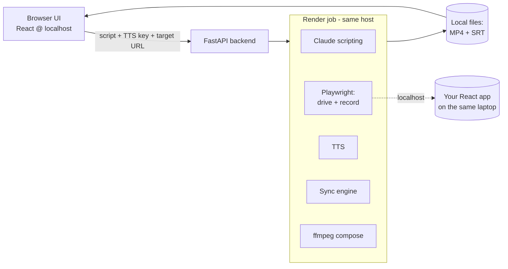

# MVP — Local Web App

The MVP is a **local-first web app**: a Python (FastAPI) backend serving a small React UI on
`localhost`, with **Playwright** and **ffmpeg** running in the same host. You open
`http://localhost:<port>` in your browser; the backend does the work. It is, deliberately, the
[future SaaS architecture](#path-to-saas) running on your laptop.

## Scope

| | MVP | Deferred |
|---|---|---|
| Target apps | **Your own React web apps** at their `localhost` URLs | Third-party / authenticated public apps |
| Capture | **Playwright** (drive + record) | Native desktop screen capture |
| Tool runs | **Locally**, single user (you) | Multi-tenant cloud |
| TTS | **Bring your own key** (ElevenLabs / Azure) | Managed / pass-through billing |
| Scripting | **Claude** writes narration + steps | — |
| Billing | None (local, single user) | [Usage-based](#path-to-saas) when productized |

## Why local-first is correct here

The targets are **your own apps running on your laptop** (`localhost`), and you are the only user.
A cloud server has **no route to `localhost`** — so running the tool in the cloud couldn't reach the
very apps you want to demo. Running locally is therefore the right call, not a compromise:

- `localhost` reaches `localhost` — the target apps are trivially reachable.
- The SaaS-only problems (reaching private apps, SSRF, auth tunnels) **don't exist** because nothing
  leaves your machine.
- Your only external spend is your **TTS key** and the **Claude API** — Playwright itself is free and
  open source, run as much as you like.

## Shape

Everything — UI, API, browser automation, render — runs on one machine. Output is written to local
files and served back to the browser for preview and download.

## Why a local web app (the shell decision)

The desktop-shell options (Electron / Tauri / PySide6) were weighed in the
[overview](index.md#technology-choices). For *this* MVP the choice is a **local web app**, because:

- **Least overhead** — no installer, no packaging, no shipping Chromium to anyone. `pip install`
  (or `docker compose up`) and open a browser.
- **Right UI tech** — the timeline / zoom / highlight editor is nicest in web, and the targets are
  already React.
- **Zero throwaway work** — this *is* the SaaS architecture (React + FastAPI + worker), just bound
  to `localhost`. Productizing later means deploying the same code, not rebuilding it.
- **`localhost` reaches `localhost`** — exactly what the targets require.

Electron/Tauri earn their keep only when you want a **double-click app to distribute to other
people**. That's not the MVP; when it is, the React UI ports into a Tauri shell with little change.

## Why Playwright is the keystone

Beyond recording video, Playwright gives **auto-waiting and network/DOM-settle detection** — it
knows exactly when a click's navigation or React re-render has *finished*. That is precisely the
signal the [sync engine](sync-engine.md) needs for clean per-action timestamps; a generic screen
recorder would have to guess. It is free, MIT-licensed, and first-class in Python. (Paid hosted
browser grids exist, but are unnecessary when running locally.)

## Stack

| Concern | Choice |
|---|---|
| Backend | **FastAPI** (Python) |
| Frontend | **React**, served on `localhost` |
| Browser automation + recording | **Playwright (Python)** |
| TTS | **ElevenLabs / Azure**, bring-your-own key |
| Scripting | **Claude API** (`claude-opus-4-8`) |
| Video composition | **ffmpeg** |
| Persistence | **SQLite** + local asset folder |
| Run | `pip install` / `docker compose up` → open browser |

## Path to SaaS

Because the MVP is the SaaS architecture deployed to `localhost`, productizing is mostly deployment,
not redesign:

1. **Deploy** the same FastAPI + React + worker to a server.
2. **Add a job queue + worker pool** (the render job becomes a queued task).
3. **Handle reaching targets** — public/staging URLs work; private/`localhost` targets need a login
   step with stored credentials or a runner agent (the constraint that local-first sidesteps today).
4. **Add usage-based billing** — meter per finished video or per render-minute. Since users bring
   their own TTS key, the metered cost is **compute + Claude scripting**, not audio.

The [native desktop-app target](automation.md#desktop-backend-primary) remains a separate future
track, added as an additive local screen-capture backend — possible precisely *because* the tool
already runs locally.
