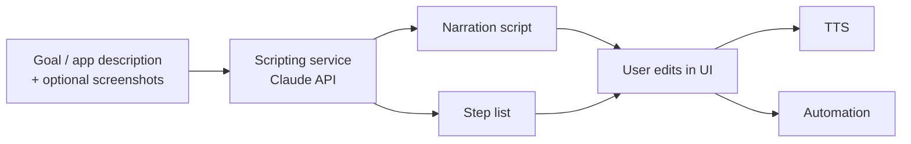

# Scripting with Claude

DemoFoundry uses the **Claude API** to author the narration **and** the
[step list](index.md#core-data-model-the-step-list) — the two halves of a demo. This is the model
layer of the app; the user reviews and edits what Claude proposes rather than writing steps by hand.

## What Claude produces

Given a goal (a feature to demo, a description of the app, optionally screenshots), Claude returns:

1. the **narration script** — what the voice says, and
2. the **step list** — the ordered actions, each paired with its narration segment and optional
   zoom/highlight notes.

The user then edits the script (including [pronunciation overrides](index.md)) and tweaks steps
before rendering.

## Two modes

| Mode | How it works | When |
|---|---|---|
| **One-shot** | Claude writes the narration and step list from the description in a single structured response. | Fast drafts; apps Claude can reason about from a description. |
| **Agentic** | Claude drives the app via **computer-use**, looks at each screen, and discovers the real steps as it goes. | Unfamiliar or complex third-party apps where the UI must be observed to be scripted. |

The agentic mode shares the same vision/computer-use capability the
[desktop automation backend](automation.md) uses to locate elements — Claude looks at a screenshot,
decides the next action, and records it as a step.

## Structured output

The step list is requested as **structured output** so it comes back as validated JSON matching the
step schema — no fragile parsing. Each step is constrained to the model's fields
(`narration_text`, `action`, `target`, `zoom_target`, `highlight_target`).

## Model and settings

| Setting | Value | Why |
|---|---|---|
| Model | **`claude-opus-4-8`** | Most capable model for planning a coherent, multi-step walkthrough. |
| Thinking | **adaptive** | Let Claude decide how much to reason per request; good for planning. |
| Output | **structured output** (`output_config.format`) | Returns the step list as schema-validated JSON. |
| Long runs | **streaming** | Agentic scripting and long scripts stream progress back to the UI. |

!!! note "The original script is preserved"
    Whatever Claude writes (and the user edits) is kept as the *original* text. Pronunciation
    overrides feed TTS, but subtitles are generated from the original — so captions read the way the
    script was written, not the phonetic spelling. See the [overview](index.md).

## Where it sits in the pipeline

Claude produces the first draft; the user stays in control; the rest of the pipeline
([TTS](index.md), [automation](automation.md), [sync](sync-engine.md)) runs on the approved step
list.
