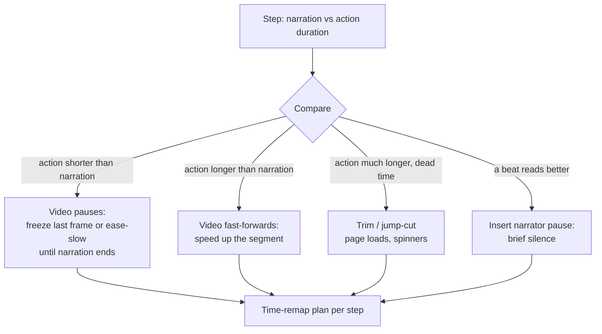
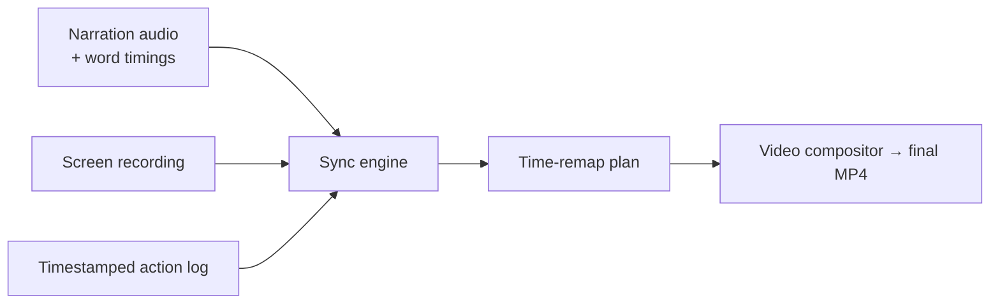

# Sync Engine

The sync engine is DemoFoundry's core differentiator. It **automatically** aligns narration and
video so the two never drift — pausing the video when narration runs long, fast-forwarding the
video when the action runs long — with no manual timeline editing.

## Why it can be automatic

Manual demo tools force you to hand-place every pause because they only capture **one** side of the
timeline (the screen recording). DemoFoundry generates **both** sides:

- The [TTS service](index.md#libraries) renders the narration, so it knows each step's **exact
  audio duration**.
- The [automation engine](automation.md) drives the app, so it logs the **exact start/end
  timestamp** of every action.

With both timelines in hand, reconciling them is a deterministic computation, not a manual chore.

## The reconciliation rule

Audio is the **master clock**. For each step, compare the narration duration to the recorded action
duration and remap the **video** to fit:

| Situation | Resolution |
|---|---|
| **Action shorter than narration** | *Video pauses* — freeze the last frame (or ease-slow the motion) until the narration segment finishes. |
| **Action longer than narration** | *Video fast-forwards* — speed up the recorded segment. Ideal for long typing or animations. |
| **Action much longer (dead time)** | Trim or jump-cut — page loads and spinners get cut rather than sped up. |
| **A beat reads better** | Insert a short *narrator pause* (silence) so a key moment lands. |

The engine emits a **time-remap plan** — a per-step list of operations — which the video compositor
applies.

## How it renders

The compositor implements the plan with **ffmpeg**:

| Operation | ffmpeg mechanism |
|---|---|
| Speed up / slow down a segment | `setpts` (video) |
| Freeze / hold a frame | `tpad` / frame hold |
| Trim dead time | `trim` + concat |
| Narrator pause | `adelay` / `apad` on the audio track |
| Zoom (Ken Burns) | scale + crop keyframes |
| Highlight | overlay drawn from the step's `highlight_target` |

## Word-level timing comes mostly for free

DemoFoundry targets **ElevenLabs** and **Azure** for TTS, and both return **word-level timing**
(ElevenLabs character/word timestamps; Azure `WordBoundary` events). That gives the sync engine and
the subtitle service accurate per-word timing without a separate alignment pass —
**faster-whisper** forced alignment is only a fallback for voices or providers that don't supply
timings.

## Inputs and output

The engine never touches pixels itself — it produces the plan; the compositor renders it. That
separation keeps the timing logic testable in isolation (given durations in, assert the plan out)
without rendering video.
