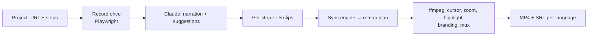

# MVP Features

The build checklist. The [architecture](architecture/index.md) explains *how*; this defines *what
to build first*. Point a developer (or Claude) here to start coding.

Design principle: **single-user/local now, multi-tenant-ready underneath.** Keep projects, assets,
and keys behind small interfaces so the same code [deploys as the SaaS](architecture/mvp.md#path-to-saas)
for future customers without a rewrite.

## In scope (MVP)

| # | Feature | Notes / default |
|---|---|---|
| 1 | **Project** | Create a project: target URL (your React app on `localhost`), steps, output settings. Stored locally (SQLite + asset folder). |
| 2 | **Record mode** | Drive the target with **Playwright** once: execute each step's action, record video, log per-action timestamps + element bounding boxes. Selectors via `data-testid` convention + role/text fallback. |
| 3 | **Scripting (Claude)** | Claude writes the **narration** and **suggests** zoom/highlight points from the recorded flow. User edits; original text kept for captions. |
| 4 | **Pronunciation editing** | Per-step overrides feed TTS; captions use the original text. |
| 5 | **Voice & audio** | Pick a voice; render **one TTS clip per step** with word-level timings. Bring-your-own TTS key (ElevenLabs / Azure). |
| 6 | **Sync engine** | Auto-align audio↔video per step: hold (pause) when narration runs long, speed up when the action runs long, trim dead time. Audio is the master clock. |
| 7 | **Cursor + effects** | Synthesize a visible cursor + click animation; apply zoom (Ken Burns) and highlight in post from captured coordinates. |
| 8 | **Branding** | Themeable intro/outro bumper, logo, colors, optional background music. **Claude-designed** theme; reuse existing brand pieces. |
| 9 | **Subtitles & translation** | SRT from the original script; translate **audio + SRT** into N languages, re-narrating + re-syncing per language. |
| 10 | **Output & preview** | 1080p 16:9 **MP4 + SRT**. In-app preview and download. Web-playable (`<video>` + `<track>`). |

## Pipeline (decided defaults)

- **Record once, narrate cheaply.** The browser run is decoupled from TTS/sync/compose, so editing
  narration or adding a language never re-drives the browser.
- **Effects in post.** Cursor, zoom, highlight rendered by ffmpeg from captured coordinates —
  deterministic and re-runnable.
- **Seeded state.** Run against known dev fixtures so re-runs are stable.

## Out of scope (deferred)

| Item | When |
|---|---|
| Agentic step-discovery (Claude drives the app to find steps) | v2 — MVP uses record mode |
| Vertical / square output for social promos | After 16:9 lands (changes zoom framing) |
| Native desktop-app targets | Future track — additive local capture backend |
| OS-keychain key storage | MVP uses local env/`.env` |
| Multi-user, auth for private targets, billing | The [SaaS path](architecture/mvp.md#path-to-saas) |

## Grow-the-base hooks (build now, exercise later)

So future customers cost deployment, not redesign:

- **Project/asset model** keyed so it becomes per-user without schema change.
- **Pluggable capture source** (web now; native + camera later) behind one interface.
- **Pluggable TTS provider** (ElevenLabs/Azure now; managed later).
- **Same FastAPI + React** code deploys to a server; add a job queue + worker pool.
