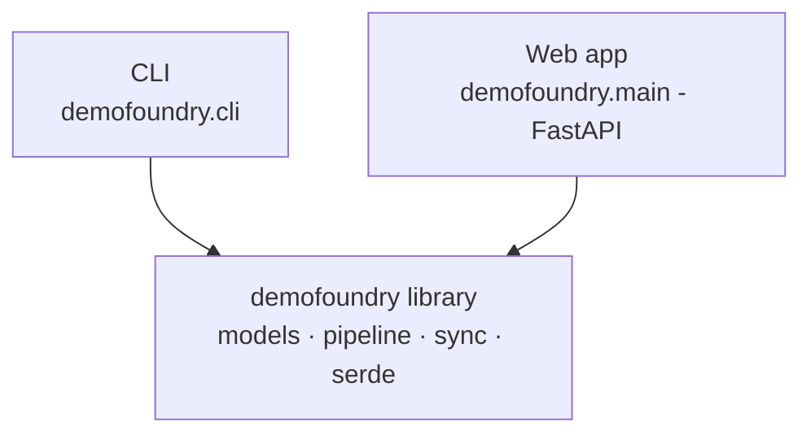

# Library

DemoFoundry is a **reusable library** with two thin frontends. You can import the pipeline directly
to embed it, script it, or build your own UI on top.

## Three layers



The library has **no web or CLI coupling** and a **pure-stdlib core** — `models`, `sync`, `serde`,
and `compose` import with nothing installed. Heavy pieces are optional extras
(`browser`, `ai`, `voice`, `web`) so you only pull in what you use.

## Install

```bash
pip install -e backend                 # core only
pip install -e "backend[browser,ai]"   # + Playwright capture + Claude scripting
```

## The pieces

| Import | Role |
|---|---|
| `demofoundry.models` | `Step`, `ActionRecord`, `Segment`, `RenderPlan` (dataclasses) |
| `demofoundry.pipeline.capture` | `await capture(url, steps, out)` → video + records |
| `demofoundry.pipeline.scripting` | `generate(desc, steps)` → narration via Claude |
| `demofoundry.pipeline.tts` | `synth(text, voice, out)` → audio + duration + word timings |
| `demofoundry.pipeline.sync` | `build_plan(steps, records, durations)` → `RenderPlan` |
| `demofoundry.pipeline.compose` | `render(plan, video, records, out)` → MP4; `write_srt(...)` |
| `demofoundry.render` | `await render_to_files(url, steps, out)` → end-to-end |
| `demofoundry.serde` | load/save steps, records, plans as JSON |

## Example — use just the sync engine

The sync engine is pure and dependency-free; you can drive it with your own timings:

```python
from demofoundry.models import Step, ActionType, ActionRecord
from demofoundry.pipeline import sync

steps = [Step(id="s1", action=ActionType.CLICK, narration_text="Click to begin.")]
records = {"s1": ActionRecord("s1", started_at=0.0, ended_at=0.6)}  # quick action
durations = {"s1": 3.0}                                             # longer narration

plan = sync.build_plan(steps, records, durations)
seg = plan.segments[0]
print(seg.op, seg.hold_tail)   # SegmentOp.HOLD 2.4  -> video pauses to fit the voiceover
```

## Example — full render

```python
import asyncio
from demofoundry import render, serde

steps = serde.load_steps("steps.json")
video, srt = asyncio.run(
    render.render_to_files("http://localhost:3000", steps, out_dir="work")
)
print(video, srt)
```

## Testing

The core is unit-tested and the tests run with **plain Python** (no binaries, no keys):

```bash
cd backend
python tests/test_sync.py     # the sync engine
python tests/test_serde.py    # JSON round-trips
python tests/test_tts.py      # silent TTS fallback
python tests/test_cli.py      # CLI plumbing (tts → sync)
python tests/test_compose.py  # ffmpeg render of a 2-segment plan + SRT
python tests/test_capture.py  # real Playwright path vs a bundled HTML fixture
```

`test_capture` drives a bundled static page (`tests/fixtures/sample.html`) so the Playwright path
has a repeatable test with no app dependency; `test_compose` renders a real clip through the
filtergraph and probes its duration. Both **skip cleanly** when their binary (Chromium / ffmpeg)
isn't installed. Tests are added per step as the pipeline grows, so each stage stays independently
verifiable.
