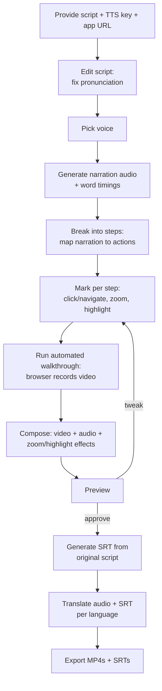

# Overview

DemoFoundry turns a narration script into a localized demo video. This page walks through the
end-to-end process.

## The workflow

## Steps in detail

1. **Inputs.** Supply the narration script, your text-to-speech API key, and the URL of the
   (web) app you want to demo.
2. **Pronunciation editing.** Adjust how words are spoken. The *original* script text is preserved
   — it becomes the caption source so subtitles match what was written, not the phonetic spelling.
3. **Voice and audio.** Choose a voice; DemoFoundry generates the narration audio and captures
   word-level timings used to sync everything else.
4. **Plan the walkthrough.** The demo is a list of **steps**. Each step pairs a narration segment
   with an action (click, navigate, type) and optional **zoom** and **highlight** notes. The audio
   length of each segment drives its timing on screen.
5. **Record.** DemoFoundry replays the steps against your app's URL and records the session.
6. **Compose and preview.** Audio, video, and the zoom/highlight effects are combined into a draft
   you can preview and tweak.
7. **Localize and export.** Subtitles (SRT) are generated from the original script, then the audio
   and subtitles are translated into the languages you select. Export the final videos and subtitle
   files.
